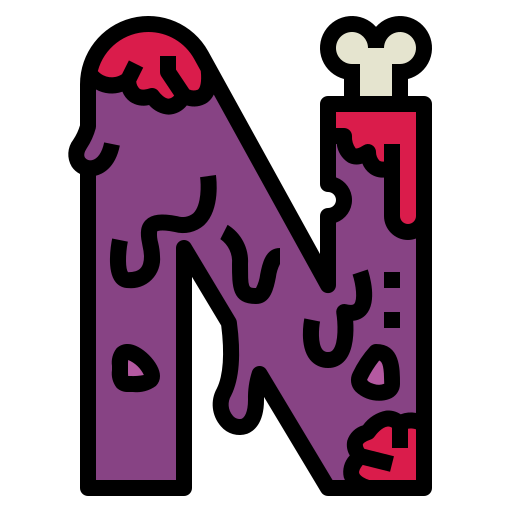

<p align="center">
  
</p>

<h1 align="center">Nightwatch</h1>

<p align="center">
  <strong>Your personal streaming companion — synchronized playback, watch parties, live streaming, and voice calls.</strong>
</p>

---

Welcome to the Nightwatch frontend repository. This is a Next.js (App Router) application designed for real-time, synchronized media playback and interactive collaboration.

With over 400+ modules spanning complex real-time domains, this project implements a highly optimized, edge-ready architecture mixing Server-Side Rendering (SSR) with heavy client-side Peer-to-Peer data sharing via WebRTC and Real-Time Messaging.

## Documentation Index

Due to the scale of the application, our detailed technical documentation is split into domain-specific guides inside the `/docs` folder.

### Core Architecture
- [Setup & Local Development](./docs/SETUP.md): Instructions for environment variables, dependencies, and local start.
- [High-Level Architecture](./docs/ARCHITECTURE.md): The Next.js framework, real-time topologies, React state strategies, platform layers, PiP system, and player compound components.
- [API Layer & Communication](./docs/API_LAYER.md): Integration with Node.js backend, Agora RTM/RTC, and WebRTC protocols.
- [State Management Strategy](./docs/STATE_MANAGEMENT.md): Multi-tiered state management using Provider Contexts, Server Actions, and React hooks.
- [Testing Methodology](./docs/TESTING.md): Unit, integration, and E2E testing strategies using Vitest and Playwright.
- [UI & Styling Guidelines](./docs/UI_GUIDELINES.md): Neo-brutalist design rules, Tailwind utility constraints, and CVA component usage.
- [Internationalization](./docs/I18N.md): 14 languages, 8 namespaces, cookie-based locale, RTL support, and next-intl integration.

### Feature Details
- [Authentication](./docs/features/AUTHENTICATION.md): Dual-factor HTTP-only cookie sessions and Anti-Bot protection.
- [Livestream Framework](./docs/features/LIVESTREAM.md): RTMP ingestion, HLS transmission, and Agora RTM Live Chat loops.
- [Livestream Clipping](./docs/features/CLIPS.md): Record live moments, FFmpeg processing, MinIO storage, public sharing, and Library page.
- [User Profile](./docs/features/PROFILE.md): Zod validation, S3 avatar uploads, and Security mutations.
- [Ask AI](./docs/features/ASK_AI.md): Voice-to-voice AI assistant with Nova 2 Sonic, tool calling, and content search.
- [Search Engine](./docs/features/SEARCH.md): Debounced URL-parameter driven queries and infinite scroll facets.
- [Watch Content](./docs/features/WATCH.md): VOD operations, HLS bitrates, and Redis heartbeat synchronization.
- [Watchlist](./docs/features/WATCHLIST.md): Optimistic UI, Radix primitives, and TanStack query caching.
- [Watch Party](./docs/features/WATCH_PARTY.md): Decentralized peer-to-peer event pipelines over Agora Real-Time Messaging.
- [Friends & Voice Calls](./docs/features/FRIENDS.md): Friend system, voice calls, media ducking, and online presence.
- [Music](./docs/features/MUSIC.md): JioSaavn streaming, AudioEngine, synced lyrics, playlists, and Redis queue.
- [Offline Downloads](./docs/features/DOWNLOADS.md): Cross-platform HLS/MP4 downloads, offline library, and quality selection.
- [Mobile Application](./docs/features/MOBILE.md): Capacitor setup, 16 native plugins, mobile bridge API, and dev workflow.

## Technology Stack

- **Framework:** Next.js (React 18+, App Router)
- **Desktop Wrapper:** Electron (Node.js)
- **Mobile Wrapper:** Capacitor (iOS, Android)
- **Language:** TypeScript (Strict Mode)
- **Styling:** Tailwind CSS (Custom Neo-Brutalist Theme)
- **Internationalization:** next-intl (14 languages, cookie-based)
- **Real-Time Data:** Agora RTM, Socket.IO (friends, presence, voice calls)
- **Real-Time Media:** Agora RTC (WebRTC — watch party, voice calls)
- **Quality Assurance:** Biome (Linting/Formatting), Vitest (Unit Testing), Playwright (E2E Testing)
- **Package Manager:** pnpm

## Project Structure Overview

The `src` directory governs all application code, rigidly separated by domain logic:

```bash
src/
├── app/               # Next.js App Router (Pages, Layouts, Server forms)
├── capacitor/         # Capacitor mobile-specific modules (downloads, providers)
├── components/        # Global, reusable UI primitives (Buttons, Inputs, Dialogs)
├── features/          # Domain-isolated modules (auth, profile, watch-party, livestream, friends)
├── hooks/             # Global generic hooks
├── lib/               # Shared utilities, formatting scripts, and global singletons
├── providers/         # Global React Contexts (Socket, Session, Theme)
└── types/             # Global TypeScript types (Zod inferred and explicit interfaces)
```

## Quick Start

Ensure you have your environment variables configured (see [Setup Guide](./docs/SETUP.md)).

```bash
# Install all dependencies
pnpm install

# Launch development environment with Turbopack
pnpm dev
```

For thorough type-checking, formatting, and tests before committing:
```bash
pnpm validate
```

## Desktop Application (macOS, Windows, Linux)

This repository also contains a native OS desktop wrapper using Electron (Node.js). It adds Picture-in-Picture mode, system tray icons, Discord Rich Presence, media key controls, offline downloads, and macOS Dock unread badging.

To develop the desktop app locally:
```bash
pnpm desktop:start
```

### Automated Cloud Builds (Releases)

The application uses GitHub Actions to automatically build and publish `.dmg` (Mac), `.msi`/`.exe` (Windows), and `.AppImage`/`.deb` (Linux) binaries whenever a new "v*" version tag is created.

You can easily trigger a new desktop build using the official [GitHub CLI (`gh`)](https://cli.github.com/):

```bash
# 1. Update the version in package.json
# 2. Commit the change
# 3. Create and push a new release tag using the gh cli
gh release create v1.32.0 --title "v1.32.0 - Major Update" --notes "Release notes here..."
```

As soon as the tag is pushed to GitHub, the `Build Electron Desktop App` action will spin up cloud runners, compile the Rust + Next.js binaries, and attach the installer links automatically to the GitHub Releases page.

## Mobile Application (iOS, Android)

The application includes a native mobile wrapper using Capacitor. It wraps the deployed Next.js app in a native WebView with access to device APIs: haptic feedback, status bar theming, CallKit voice calls, background music playback, lock screen media controls, native share sheet, offline downloads, and swipe-based navigation.

### Native Plugins (15)

Splash Screen, Status Bar, Clipboard, Haptics, Keep Awake, Screen Orientation, Network Detection, Share, Badge, Keyboard, App Lifecycle, Preferences, Filesystem, Phone Call Notification, CallKit.

### Local Development

```bash
# Start Next.js dev server
pnpm dev

# Sync Capacitor and open in Xcode (iOS)
pnpm mobile:ios

# Sync Capacitor and open in Android Studio
pnpm mobile:android
```

For physical device testing, the WebView points to your Mac's LAN IP:
```bash
CAPACITOR_DEV=true CAPACITOR_SERVER_URL=http://192.168.x.x:3000 npx cap sync ios
```

### Production Build

```bash
# Sync with production URL (https://nightwatch.in)
npx cap sync ios

# Build from Xcode: Product → Scheme → Release → ⌘R
```

### Automated Cloud Builds (Android APK)

The `build-android.yml` GitHub Action builds a debug APK and attaches it to GitHub Releases alongside the desktop binaries.

```bash
# Trigger manually
gh workflow run build-android.yml
```

---
*For issues regarding the backend services or database administration, see the respective `nightwatch-backend` or `admin-nightwatch` repositories.*