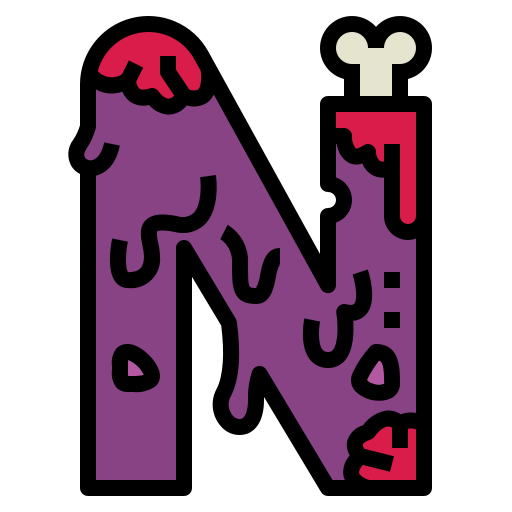

<p align="center">
  
</p>

<h1 align="center">Nightwatch</h1>

<p align="center">
  <strong>Your personal streaming companion — synchronized playback, watch parties, live streaming, and voice calls.</strong>
</p>

---

Welcome to the Nightwatch frontend repository. This is a Next.js (App Router) application designed for real-time, synchronized media playback and interactive collaboration.

Spanning roughly 600 TypeScript modules across several real-time domains, it mixes Server-Side Rendering with heavy client-side peer-to-peer data sharing over WebRTC and real-time messaging. It is a **single package** — platform variation (desktop, mobile, TV) is handled inside `src/platforms/`, not by separate workspace packages.

## Documentation

Detailed technical documentation lives in [`/docs`](./docs/README.md), organized to mirror `src/`: cross-cutting guides in `docs/architecture/`, platform shells in `docs/platforms/`, and one folder per feature in `docs/features/<name>/` matching `src/features/<name>/`.

**[→ Full documentation index](./docs/README.md)**

### Start here
- [Setup & Local Development](./docs/SETUP.md): environment variables, dependencies, local start.
- [Contributing Guide](./docs/CONTRIBUTING.md): lint rules, conventions, commit format, release process.
- [Architecture Overview](./docs/architecture/OVERVIEW.md): route guard, route groups, feature slicing, native bridges, player compound components.

### Core Architecture
- [API Layer & Communication](./docs/architecture/API_LAYER.md): `apiFetch`, proactive token refresh, and the transports in use.
- [State Management Strategy](./docs/architecture/STATE_MANAGEMENT.md): TanStack Query, Zustand, Context, and `useReducer`.
- [Testing Methodology](./docs/architecture/TESTING.md): Vitest and Playwright layout, coverage thresholds, CI quality gate.
- [UI & Styling Guidelines](./docs/architecture/UI_GUIDELINES.md): theme tokens, dark-mode palette remap, CVA variants.
- [Global UI Shell](./docs/architecture/GLOBAL_UI.md): root layout composition, app chrome, shared hooks, onboarding tour, error boundaries, SEO.
- [Analytics & Push](./docs/architecture/ANALYTICS.md): Firebase Analytics, Crashlytics, consent gating, event catalogue, push notifications.
- [Internationalization](./docs/architecture/I18N.md): 14 languages, 8 namespaces, cookie-based locale, RTL.

### Platforms
- [Desktop Application](./docs/platforms/DESKTOP.md): Electron wrapper, system tray, Discord Rich Presence, media keys, auto-updates.
- [Mobile Application](./docs/platforms/MOBILE.md): Capacitor setup, 21 native plugins, mobile bridge API, dev workflow.
- [Smart TV](./docs/platforms/SMART_TV.md): Android TV — spatial navigation, D-pad player, QR login, overscan.

### Feature Details
- [Authentication](./docs/features/auth/README.md): cookie sessions, OTP, QR login, and anti-bot protection.
- [Google OAuth](./docs/features/auth/GOOGLE_OAUTH.md): Google Sign-In (web redirect + native iOS/Android).
- [User Profile](./docs/features/profile/README.md): Zod validation, avatar uploads, and security mutations.
- [Hub](./docs/features/hub/README.md): the destination grid and landing surface.
- [Search Engine](./docs/features/search/README.md): debounced URL-parameter driven queries and infinite scroll facets.
- [Watch Content](./docs/features/watch/README.md): VOD operations, HLS/DASH engines, and progress synchronization.
- [Watchlist](./docs/features/watchlist/README.md): optimistic UI and TanStack Query caching.
- [Watch Party](./docs/features/watch-party/README.md): decentralized peer-to-peer event pipelines over Agora RTM.
- [Watch Party — Live TV](./docs/features/watch-party/LIVE_TV.md): watching a live channel together and blocked-autoplay recovery.
- [3D Theatre Mode](./docs/features/watch-party/THEATRE_3D.md): opt-in 3D auditorium — R3F scene, Rapier walking, avatar sync.
- [Livestream Framework](./docs/features/livestream/README.md): IPTV channel browse, categories, and stream resolution.
- [Livestream Clipping](./docs/features/clips/README.md): server-side clip recording, public sharing, and the Library page.
- [Friends & Voice Calls](./docs/features/friends/README.md): friend system, voice calls, media ducking, and online presence.
- [Music](./docs/features/music/README.md): JioSaavn streaming, AudioEngine, synced lyrics, playlists, gapless playback, crossfade, equalizer, and device transfer.
- [Music Discover](./docs/features/music-discover/README.md): swipe-based song discovery with audio previews and haptic feedback.
- [Manga](./docs/features/manga/README.md): MangaPlus reader with browse/search, favourites, and progress persistence.
- [Ask AI](./docs/features/ask-ai/README.md): voice-to-voice AI assistant with tool calling and content search.
- [Remote Control](./docs/features/remote-control/README.md): mobile-to-desktop video remote control via Socket.IO.
- [Games](./docs/features/games/README.md): embedded HTML5 game catalogue, asset pipeline, and in-app player.
  - [Games Patching](./docs/features/games/PATCHING.md): patching third-party game bundles for embedded use.
  - [Games Deployment](./docs/features/games/DEPLOYMENT.md): building and shipping game assets.

## Technology Stack

- **Framework:** Next.js 16 (React 19, App Router). No Server Actions — mutations go through `apiFetch` to the Node.js backend.
- **Desktop Wrapper:** Electron (Node.js)
- **Mobile Wrapper:** Capacitor (iOS, Android, Android TV)
- **Language:** TypeScript (Strict Mode)
- **Styling:** Tailwind CSS v4 (CSS-native `@theme`, custom neo-brutalist palette)
- **Internationalization:** next-intl (14 languages, cookie-based)
- **Real-Time Data:** Agora RTM (watch party signalling and chat), Socket.IO (friends, presence, voice-call signalling, music device sync, remote control)
- **Real-Time Media:** Agora RTC (WebRTC — watch party, voice calls)
- **Video:** `hls.js` and `dash.js` behind a shared engine abstraction
- **Server State & Caching:** TanStack Query (`useQuery`, `useMutation`, stale-while-revalidate)
- **Client State:** Zustand (auth state, music playback state)
- **Firebase:** Analytics, Crashlytics (native), and Cloud Messaging push
- **Quality Assurance:** Biome (linting/formatting), Vitest (unit — 187 files, 2,644 tests), Playwright (E2E)
- **Package Manager:** pnpm

## Project Structure Overview

The `src` directory governs all application code, rigidly separated by domain logic:

```bash
src/
├── app/               # Next.js App Router (pages, layouts, route groups)
├── capacitor/         # Capacitor mobile modules (push, analytics, music service)
├── components/        # Global, reusable UI primitives (buttons, inputs, dialogs)
├── features/          # Domain-isolated modules (16 features — see docs/features/)
├── hooks/             # Global generic hooks
├── i18n/              # Internationalization (14 locales, 8 namespaces each)
├── lib/               # Shared utilities, native bridges, and global singletons
├── platforms/         # Platform-specific layers (desktop, mobile, smart-tv)
├── providers/         # Global React contexts (query, auth, socket, theme, intl)
├── store/             # Zustand global stores (auth)
├── types/             # Global TypeScript types
└── proxy.ts           # Server-side route guard (Next.js 16 renamed middleware → proxy)
```

Tests live in `tests/`, mirroring `src/` — not colocated.

## Quick Start

Ensure you have your environment variables configured (see [Setup Guide](./docs/SETUP.md)).

```bash
# Install all dependencies
pnpm install

# Launch development environment with Turbopack
pnpm dev
```

For thorough type-checking and linting before committing:
```bash
pnpm check        # Biome lint/format validation
pnpm type-check   # TypeScript strict mode
pnpm test         # Vitest unit tests
```

## Desktop Application (macOS, Windows, Linux)

This repository also contains a native OS desktop wrapper using Electron (Node.js). It adds system tray icons, Discord Rich Presence, media key controls, and macOS Dock unread badging.

To develop the desktop app locally:
```bash
pnpm desktop:start
```

### Automated Cloud Builds (Releases)

Releases are automated. `release.yml` runs [release-please](https://github.com/googleapis/release-please) on every push to `main`: it reads Conventional Commit messages, maintains `CHANGELOG.md`, and opens a release PR. Merging that PR creates the `v*` tag, which triggers `build-desktop.yml`, `build-android.yml`, and `build-android-tv.yml` on cloud runners. Those workflows compile the Next.js + Electron binaries and attach `.dmg` (macOS), `.msi`/`.exe` (Windows), `.AppImage`/`.deb` (Linux), and the Android APKs to the GitHub Releases page.

Do not bump the version in `package.json` or create tags by hand — release-please owns both, and a manual tag will desync `.release-please-manifest.json`.

To build outside the release flow, dispatch a workflow directly:

```bash
gh workflow run build-desktop.yml
```

## Mobile Application (iOS, Android)

The application includes a native mobile wrapper using Capacitor. It wraps the deployed Next.js app in a native WebView with access to device APIs: haptic feedback, status bar theming, CallKit voice calls, background music playback, lock screen media controls, native share sheet, and swipe-based navigation.

### Native Plugins (21)

Splash Screen, Status Bar, Clipboard, Haptics, Keep Awake, Screen Orientation, Network Detection, Share, Badge, Keyboard, App Lifecycle, Preferences, Device Info, Push Notifications, Phone Call Notification, CallKit (Incoming Call Kit), Social Login, Volume Buttons, Volumes, Firebase Analytics, Firebase Crashlytics.

### Local Development

```bash
# Start Next.js dev server
pnpm dev

# Sync Capacitor and open in Xcode (iOS)
pnpm mobile:ios

# Sync Capacitor and open in Android Studio
pnpm mobile:android
```

For physical device testing, the WebView points to your Mac's LAN IP:
```bash
CAPACITOR_DEV=true CAPACITOR_SERVER_URL=http://192.168.x.x:3000 npx cap sync ios
```

### Production Build

```bash
# Sync with production URL (https://nightwatch.in)
npx cap sync ios

# Build from Xcode: Product → Scheme → Release → ⌘R
```

### Automated Cloud Builds (Android APK)

The `build-android.yml` GitHub Action builds a debug APK and attaches it to GitHub Releases alongside the desktop binaries.

```bash
# Trigger manually
gh workflow run build-android.yml
```

### Android TV

The app also ships an Android TV build that runs the same WebView-based app with D-pad spatial navigation support. The TV remote's arrow keys move focus between interactive elements, Enter selects, and Back navigates history.

```bash
# Build TV APK locally
cd android && ./gradlew assembleRelease -PtvBuild

# Trigger CI build
gh workflow run build-android-tv.yml
```

The TV build uses a separate application ID (`com.nightwatch.in.tv`) so it can coexist with the mobile app on the Play Store.

---
*For issues regarding the backend services or database administration, see the respective `nightwatch-backend` or `admin-nightwatch` repositories.*