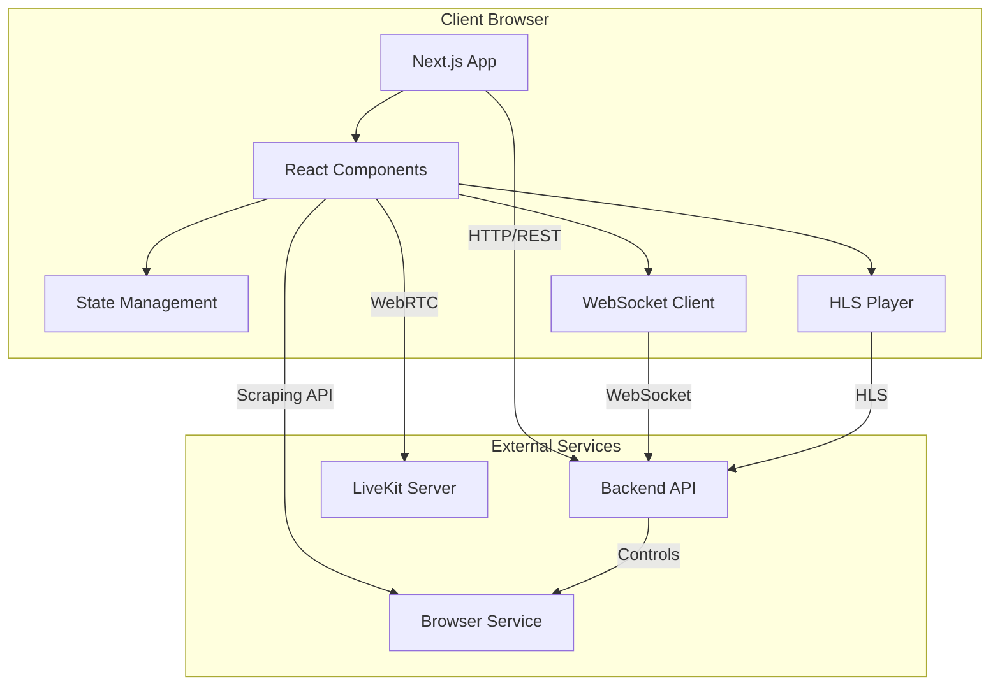

# Watch-Rudra Frontend Documentation

> Comprehensive documentation for the Next.js 15+ frontend application.

## 📚 Quick Navigation

- [Getting Started](./getting-started.md)
- [Project Structure](./structure.md)
- [Features Documentation](./features/)
  - [Authentication](./features/auth.md)
  - [Video Player](./features/video-player.md)
  - [Search](./features/search.md)
  - [Watch Party](./features/watch-party.md)
  - [Profile Management](./features/profile.md)
- [Architecture](./architecture/)
  - [State Management](./architecture/state-management.md)
  - [Routing & Navigation](./architecture/routing.md)
  - [API Integration](./architecture/api-integration.md)
- [Testing Guide](./testing.md)
- [Deployment](./deployment.md)

---

## 🎯 Overview

Watch-Rudra frontend is a modern, server-side rendered Next.js application built with:

- **Next.js 16+** - React framework with App Router
- **TypeScript** - Type-safe development
- **Tailwind CSS** - Utility-first CSS framework  
- **Shadcn/UI** - High-quality React components
- **Zod** - Schema validation
- **Socket.IO** - Real-time communication
- **HLS.js** - Adaptive streaming video player
- **LiveKit** - WebRTC for watch parties
- **Vitest** - Fast unit testing

---

## 🏗️ System Architecture



---

## 🚀 Quick Start

### Prerequisites

- Node.js 20+
- pnpm 9+

### Installation

```bash
# Install dependencies
pnpm install

# Set up environment variables
cp .env.example .env

# Start development server
pnpm dev
```

### Environment Variables

```env
# Backend API
NEXT_PUBLIC_BACKEND_URL=http://localhost:4000
NEXT_PUBLIC_WS_URL=http://localhost:4000

# LiveKit (Watch Party)
NEXT_PUBLIC_LIVEKIT_URL=ws://localhost:7880

# Cloudflare Turnstile (Captcha)
NEXT_PUBLIC_TURNSTILE_SITE_KEY=your-site-key
```

---

## 📁 Project Structure

```
src/
├── app/                    # Next.js App Router
│   ├── (public)/          # Public routes (login, signup)
│   ├── (protected)/       # Authenticated routes (home, watch)
│   └── (party)/           # Watch party routes
│
├── features/              # Feature-based modules
│   ├── auth/             # Authentication
│   ├── search/           # Content search
│   ├── watch/            # Video player
│   ├── watch-party/      # Real-time watch parties
│   └── profile/          # User profile
│
├── components/
│   ├── ui/               # Shadcn components
│   └── layout/           # Layout components
│
├── hooks/                # Custom React hooks
├── lib/                  # Utilities and helpers
├── providers/            # React context providers
└── types/                # TypeScript types
```

---

## 🔑 Key Features

### 1. **Authentication**
- OTP-based email verification
- JWT token management  
- Automatic token refresh
- Session persistence

### 2. **Video Streaming**
- Adaptive HLS playback
- Quality selection
- Playback speed control
- Picture-in-picture mode
- Keyboard shortcuts
- Watch progress tracking

### 3. **Real-Time Watch Parties**
- Synchronized playback
- Live chat with reactions
- WebRTC video/audio
- Host controls
- Invite system

### 4. **Content Discovery**
- Real-time search
- Filter by type (movies/series)
- Responsive grid layout

### 5. **User Profiles**
- Avatar management
- Watch history
- Continue watching
- Custom settings

---

## 🧪 Testing

```bash
# Run all tests
pnpm test

# Watch mode
pnpm test:watch

# UI mode (interactive)
pnpm test:ui

# Coverage report
pnpm test:coverage
```

Current test coverage:
- **Auth API**: 12 tests ✅
- **Auth Schemas**: 20 tests ✅  
- **Sample Components**: 4 tests ✅
- **Total**: 36 tests passing

---

## 🏗️ Development Workflow

### 1. Component Development

```tsx
// Example: Creating a new feature component
// src/features/example/components/example-card.tsx

'use client';

import { useState } from 'react';
import { Button } from '@/components/ui';

export function ExampleCard({ data }: { data: any }) {
  const [isLoading, setIsLoading] = useState(false);

  return (
    <div className="p-4 border rounded-lg">
      <h3>{data.title}</h3>
      <Button onClick={() => setIsLoading(true)}>
        {isLoading ? 'Loading...' : 'Click Me'}
      </Button>
    </div>
  );
}
```

### 2. API Integration

```tsx
// src/features/example/api.ts

import { apiFetch } from '@/lib/fetch';

export async function getExampleData(id: string) {
  return apiFetch<ExampleResponse>(`/api/example/${id}`, {
    method: 'GET',
  });
}
```

### 3. Schema Validation

```tsx
// src/features/example/schema.ts

import { z } from 'zod';

export const exampleSchema = z.object({
  title: z.string().min(3, 'Title must be at least 3 characters'),
  description: z.string().optional(),
});

export type ExampleInput = z.infer<typeof exampleSchema>;
```

---

## 🎨 Styling Guidelines

### Tailwind CSS

```tsx
// ✅ Good: Utility-first approach
<div className="flex items-center gap-4 p-4 bg-primary text-white rounded-lg">
  <h2 className="text-xl font-bold">Title</h2>
</div>

// ❌ Avoid: Inline styles
<div style={{ display: 'flex', padding: '16px' }}>
  <h2 style={{ fontSize: '20px' }}>Title</h2>
</div>
```

### Component Variants (CVA)

```tsx
import { cva } from 'class-variance-authority';

const buttonVariants = cva(
  'inline-flex items-center justify-center rounded-md font-medium',
  {
    variants: {
      variant: {
        default: 'bg-primary text-white hover:bg-primary/90',
        outline: 'border border-input hover:bg-accent',
      },
      size: {
        default: 'h-10 px-4 py-2',
        sm: 'h-9 px-3',
        lg: 'h-11 px-8',
      },
    },
    defaultVariants: {
      variant: 'default',
      size: 'default',
    },
  }
);
```

---

## 🔐 Security Best Practices

1. **Never expose sensitive data client-side**
   - Use server components for sensitive operations
   - API keys stay in backend

2. **Validate all inputs**
   ```tsx
   const result = schema.safeParse(userInput);
   if (!result.success) {
     // Handle validation errors
   }
   ```

3. **Use HTTPS in production**
   - All API calls over HTTPS
   - Secure WebSocket connections (WSS)

4. **Implement CSRF protection**
   - Handled by backend API
   - Include tokens in requests

---

## 📦 Deployment

### Vercel (Recommended)

```bash
# Install Vercel CLI
pnpm add -g vercel

# Deploy
vercel
```

### Environment Variables (Production)

```env
NEXT_PUBLIC_BACKEND_URL=https://api.yourdomain.com
NEXT_PUBLIC_WS_URL=wss://api.yourdomain.com
NEXT_PUBLIC_LIVEKIT_URL=wss://livekit.yourdomain.com
NEXT_PUBLIC_TURNSTILE_SITE_KEY=production-key
```

---

## 🐛 Debugging

### Common Issues

1. **Hydration Errors**
   ```tsx
   // ❌ Causes hydration error
   <div>{new Date().toString()}</div>

   // ✅ Use client-side rendering
   'use client';
   const [time, setTime] = useState('');
   useEffect(() => setTime(new Date().toString()), []);
   ```

2. **API Connection Failed**
   - Check `NEXT_PUBLIC_BACKEND_URL` in `.env`
   - Verify backend is running
   - Check CORS settings

3. **WebSocket Not Connecting**
   - Verify `NEXT_PUBLIC_WS_URL`
   - Check firewall rules
   - Ensure WebSocket support in proxy

---

## 🤝 Contributing

1. Follow the existing code structure
2. Write tests for new features
3. Use TypeScript strictly
4. Follow naming conventions:
   - Components: `PascalCase`
   - Functions/variables: `camelCase`
   - Files: `kebab-case`
5. Run linter before committing:
   ```bash
   pnpm lint
   pnpm format
   ```

---

## 📈 Performance Optimization

### Code Splitting

```tsx
// Lazy load heavy components
import dynamic from 'next/dynamic';

const HeavyComponent = dynamic(() => import('./HeavyComponent'), {
  loading: () => <div>Loading...</div>,
  ssr: false, // Disable SSR if not needed
});
```

### Image Optimization

```tsx
import Image from 'next/image';

<Image
  src={posterUrl}
  alt="Movie poster"
  width={300}
  height={450}
  priority={false} // Only true for above-fold images
  loading="lazy"
/>
```

### Memoization

```tsx
import { memo, useMemo, useCallback } from 'react';

const ExpensiveComponent = memo(({ data }) => {
  const computed = useMemo(() => expensiveCalculation(data), [data]);
  const handler = useCallback(() => doSomething(), []);

  return <div>{computed}</div>;
});
```

---

## 📞 Support

- **Documentation**: `/docs`
- **Issues**: GitHub Issues
- **Backend Docs**: `../watch-rudra-backend/docs`

---

**Last Updated**: February 2026  
**Version**: 1.0.0
