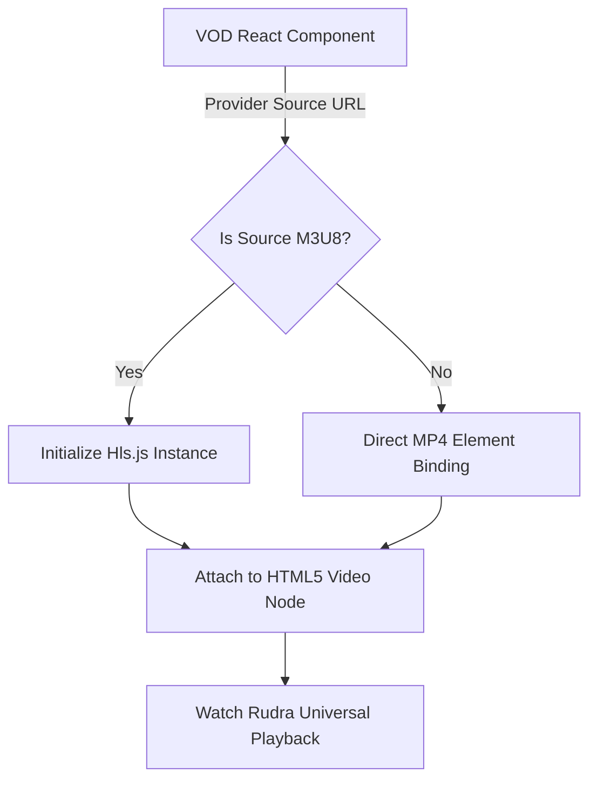

# Video Playback & Streaming Architecture

Watch Rudra focuses on aggregating media into a single, high-performance web interface. This demands strict network conditions and specialized browser configurations to ensure video formats like HLS and DASH bypass CORS constraints and playback optimally.

## Core Setup

We implement the `VideoVODPlayer.tsx` and `ActiveWatchParty.tsx` elements. Both rely on proxy streams handling. Rather than simply throwing `<video src="...">` onto the screen and praying, we utilize custom shims.

### Why Not Just The Native `<video>` Tag?

When streaming `.m3u8` playlists (Apple's HTTP Live Streaming) or adaptive bitrates, raw HTML5 tags fail in most desktop browsers (except Safari).

**Solution**:
We integrate `hls.js` natively through a wrapper.

## Overcoming CORS and Hotlink Protection

Many CDNs detect requests coming from `https://watch.rudrasahoo.live` and reject them to save bandwidth (returning HTTP 403 Forbidden or 401 Unauthorized for hotlinking).

This presents a massive challenge as we stream directly in the client. We solve this across the two platforms (Web vs. Desktop):

### The Electron Fix (Desktop)

The Desktop App modifies its request headers via the `session.defaultSession.webRequest.onBeforeSendHeaders` intercept.

It strips our generic web `Referer` and mimics the source provider, completely sidestepping standard web CORS rules because Electron acts as a native application without browser domain isolation boundaries. This allows seamless video rendering.

### The Next.js NextApi Proxy (Web)

Since standard web browsers fiercely enforce Cross-Origin policies, Watch Rudra proxies the requested `m3u8` manifests or `.ts` chunks through our `env.ts` configured proxy layers, hiding the end-user's browser origins from the external CDNs.

## Video Error Fallbacks

If a stream fails parsing in `hls.js` or is blocked, the frontend:
1. Catches the error via `videoRef.current.onerror`
2. Automatically tries the next available backup mirror link found in the search logic.
3. Renders a stylized fallback Neo-Brutalist overlay prompting the user to wait or reload.
