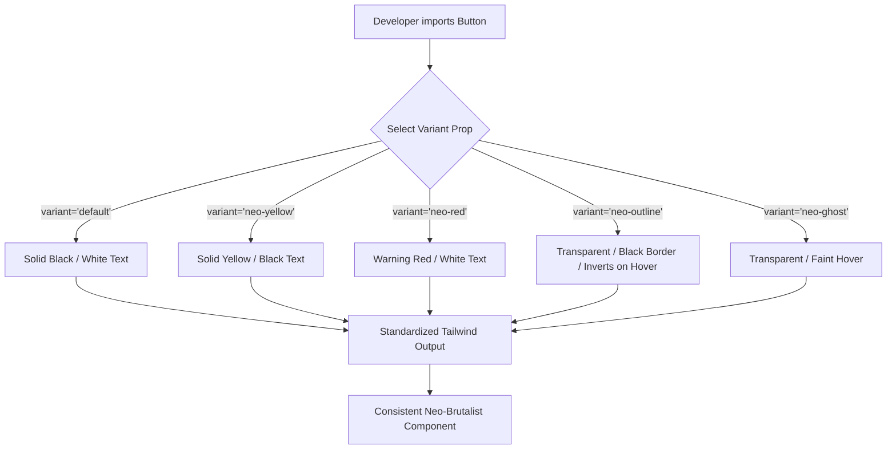

# UI and Styling Guidelines

Nightwatch follows a cohesive Neo-Brutalist design system. This document outlines the rules, tools, and component APIs required to maintain visual consistency across the frontend application.

## Design Philosophy: Neo-Brutalism

Our interface rejects soft, subtle aesthetics in favor of bold, highly readable, and structurally rigid elements. 

Core principles to follow when building new UI components:
- **Thick Borders:** Use standard structural borders (e.g., `border-4 border-border`).
- **High Contrast:** Text must have stark contrast against its background. Black text on white, or white text on black.
- **Solid Accent Colors:** Rely on primary hex colors (`#ffcc00` for yellow, `#e63b2e` for red, `#1a1a1a` for black). Do not use gradients or soft pastel hues.
- **Sharp Typography:** Utilize the configured `font-headline` uppercase tracking formats for headers and buttons.
- **No Drop Shadows:** Avoid CSS box-shadows with blur radii. If a component needs elevation, use a solid color offset block.

## Tailwind Configuration

The `tailwind.config.ts` extends standard utilities to support our Neo-Brutalist theme.

- **Colors:** We utilize CSS variables mapped to generic names (`bg-background`, `text-foreground`, `border-border`) so dark mode can be seamlessly toggled if implemented, while maintaining the high contrast ratio.
- **Animations:** We heavily lean on Tailwind's `motion-safe:animate-in` for clean, snapping transition effects when dialogs or lobby components mount.

## Component API

To prevent developers from continually hardcoding hex values and complex Tailwind strings, we use `cva` (Class Variance Authority) to manage component states. 

Below is an overview of how variants map to the Neo-Brutalist elements, using the universal `Button` component as the prime example.



### Writing Standardized Components

When implementing a new interactive element, do not manually construct hover effects if a variant already exists.

**Incorrect (Hardcoded):**
```tsx
<button className="bg-[#ffcc00] border-4 border-black text-black hover:bg-black hover:text-white transition-colors py-4">
  Join Room
</button>
```

**Correct (Component Library):**
```tsx
<Button variant="neo-outline" className="w-full py-4 font-black uppercase tracking-widest border-4">
  Join Room
</Button>
```

## Best Practices

1. **Routing and Links:** Wrap Next.js `<Link>` components inside a `<Button asChild>` to guarantee they receive proper standard hover states and border styling.
2. **Text Standardization:** Always enforce `uppercase`, `tracking-widest`, and `font-black` on primary actionable elements to keep the aggressive typography style uniform.
3. **Responsive Design:** Maintain the border weight across screen sizes. Do not shrink `border-4` to `border-2` on mobile unless vertical space is critically constrained.