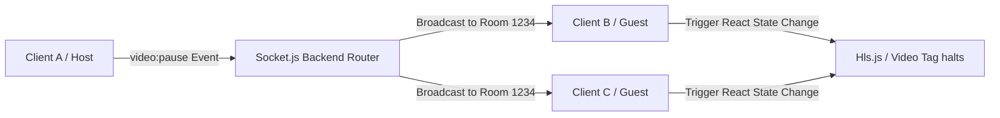

# Real-Time Event Sync via WebSockets

Watch Rudra leverages `socket.io-client` against a monolithic Node.js backend. Rather than pooling constant long-polling REST requests to determine if a peer paused their stream, we hold a fast persistent state channel.

## Watch Party Orchestration

A centralized WebSocket context is managed deep within `<SocketProvider>` and instantiated across the user session to listen to:

- `room:updated`: Synchronize video playback states.
- `chat:newMessage`: Dispatch small text-based JSON frames between users.
- `sketch:draw`: Handles live multi-user overlay drawings.

## Disconnections & Resync

If the WebSocket disconnects randomly (due to Mobile network shift or deep browser throttling when minimized), our Socket layer automatically reacquires the latest Room metadata on reconnect. 

This ensures that if a user returns to a Watch Party 10 minutes later, their timestamp snaps immediately to the current Host's timeline without heavy API re-loads.
