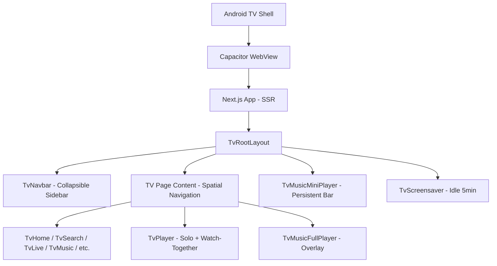
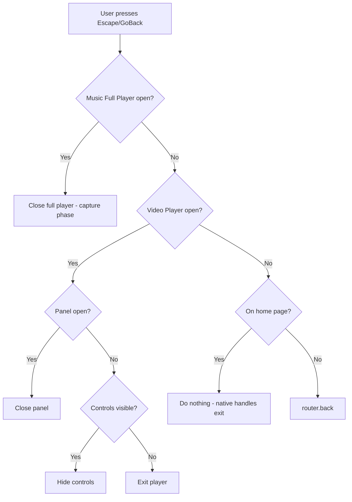
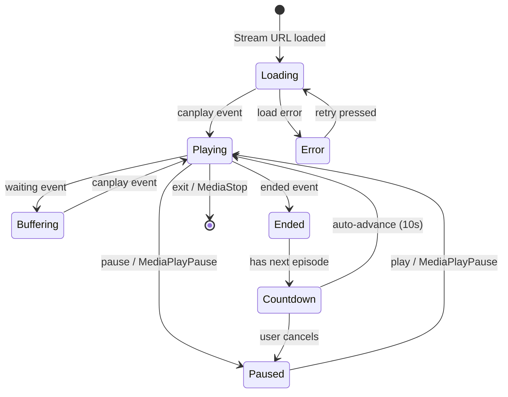
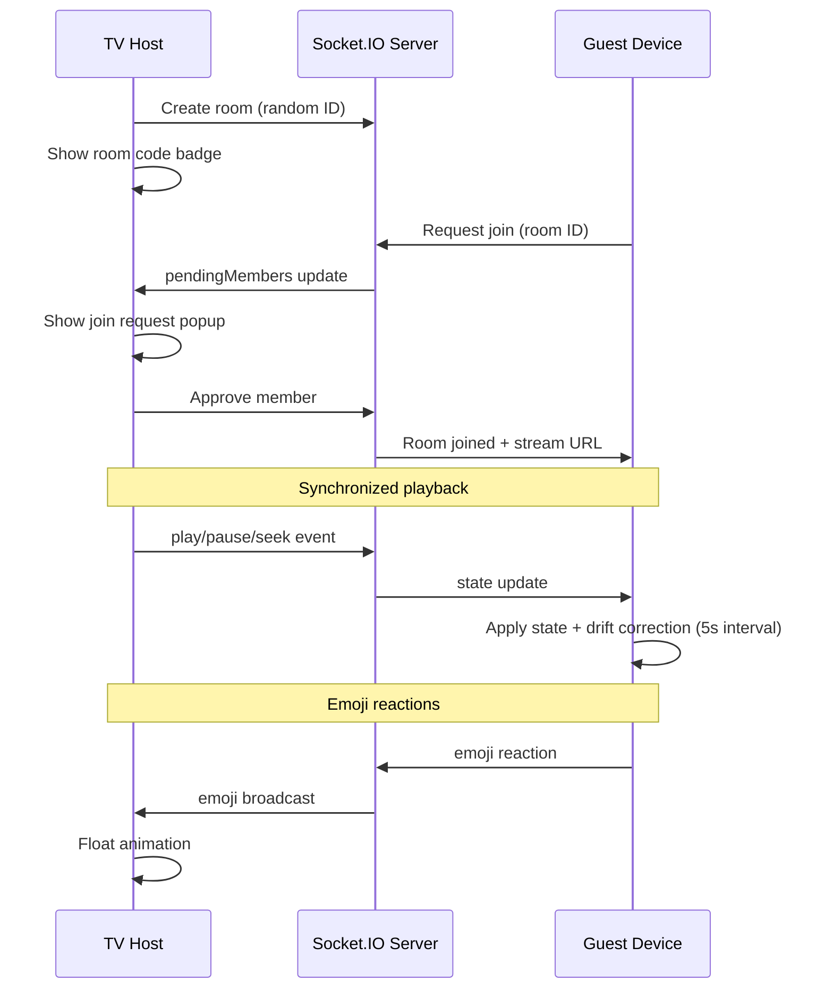
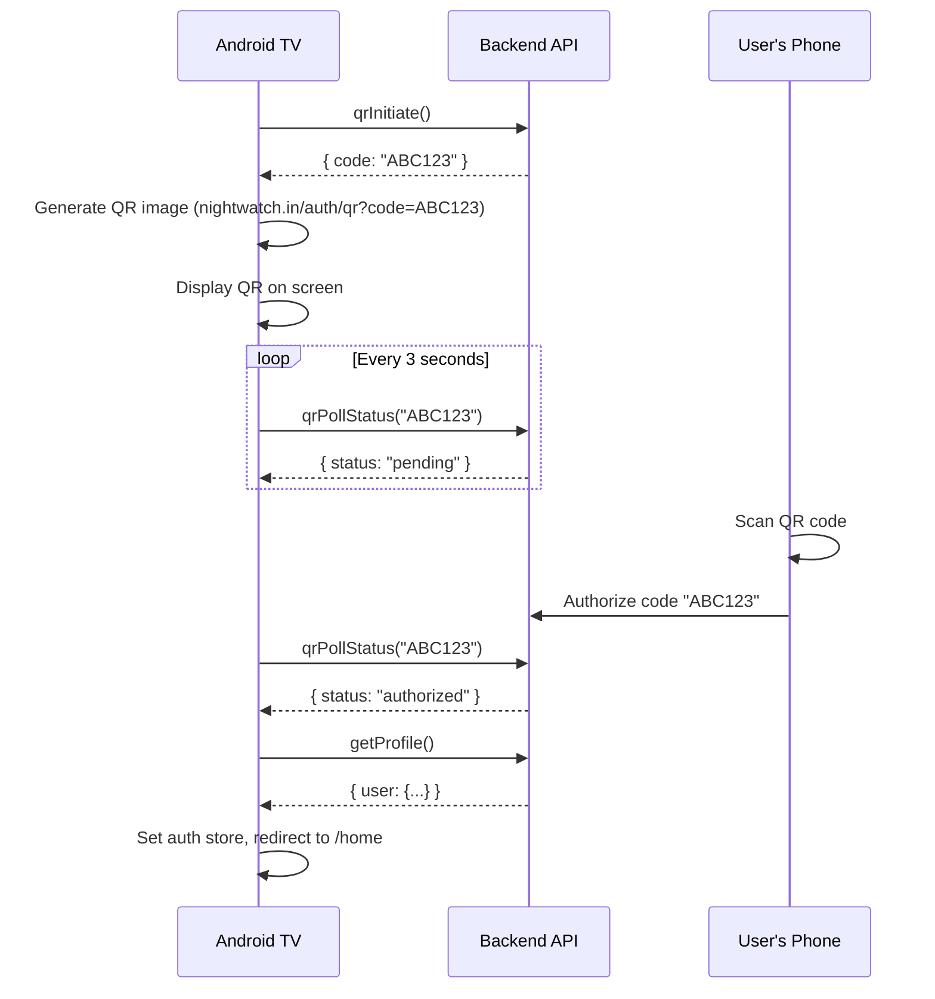

# Smart TV Application (Android TV / Google TV / Fire TV)

## Overview

Nightwatch ships a native Android TV application that runs the same Next.js web app inside a native WebView, optimized for D-pad (remote control) navigation. The app uses `@noriginmedia/norigin-spatial-navigation` for directional focus management and provides a completely separate set of UI components tailored for the 10-foot living room experience.

The TV build uses a separate application ID (`com.nightwatch.in.tv`) and coexists with the mobile app on the Play Store.

## Architecture



### Detection

```mermaid
sequenceDiagram
    participant Native as Android TV MainActivity
    participant WebView as Capacitor WebView
    participant App as Next.js App
    
    Native->>WebView: Load URL
    Native->>WebView: evaluateJavascript("window.__ANDROID_TV__=true;localStorage.setItem(...)")
    WebView->>App: Page renders
    App->>App: isTV() checks window.__ANDROID_TV__ || localStorage
    App->>App: Renders TV components (TvRootLayout)
```

The native Android `MainActivity` injects `window.__ANDROID_TV__ = true` into the WebView on launch (via `UiModeManager.getCurrentModeType() == UI_MODE_TYPE_TELEVISION`). The web app detects this via:

```ts
// src/platforms/smart-tv/lib/detection.ts
export function isTV(): boolean {
  if (typeof window === 'undefined') return false;
  if (window.__ANDROID_TV__ === true) return true;
  return localStorage.getItem('__ANDROID_TV__') === 'true';
}
```

For browser testing: `localStorage.setItem('__ANDROID_TV__', 'true')` then reload.

### Routing Strategy

TV pages are gated at the route level using two patterns:

1. **`TvPageGate`** (most pages) — renders TV content on TV, web children on non-TV:
   ```tsx
   <TvPageGate tvContent={<TvSearch />}>
     <WebSearchPage />
   </TvPageGate>
   ```

2. **Inline `isTV()` check** (player pages) — immediate branch in the component:
   ```tsx
   if (isTV() && streamUrl) return <TvWatch streamUrl={streamUrl} ... />;
   ```

## Spatial Navigation



All D-pad interaction is powered by `@noriginmedia/norigin-spatial-navigation`:

```ts
// src/platforms/smart-tv/lib/spatial-navigation.ts
init({
  throttle: 150,
  throttleKeypresses: true,
  useGetBoundingClientRect: true,
  shouldFocusDOMNode: true,
  distanceCalculationMethod: 'center',
});
setKeyMap({ left: 37, right: 39, up: 38, down: 40, enter: 13 });
```

Every interactive element uses `useFocusable()`. Focus keys follow the pattern:
- `TV_SIDEBAR` — navbar items (prefix for focus-memory guard)
- `TV_CONTENT` — main page content area
- `TV_PLAYER_CONTROLS` — player control bar
- `TV_SEARCH_INPUT` / `TV_LETTER_GRID` — search page keyboard

## Source Structure

```
src/platforms/smart-tv/
├── components/          # Reusable TV UI primitives
│   ├── TvPlayer.tsx         # Full-featured video player (solo + watch-together)
│   ├── TvPlayerControls.tsx # Seek bar, quality/subtitle panels, clip button
│   ├── TvPlayerOverlay.tsx  # Title bar + participant avatars
│   ├── TvCard.tsx           # Content card with lazy loading, progress bar, prefetch
│   ├── TvRow.tsx            # Horizontal scrollable row with auto-scroll on focus
│   ├── TvHero.tsx           # Auto-sliding banner with D-pad navigation
│   ├── TvGrid.tsx           # Auto-fill grid layout
│   ├── TvButton.tsx         # Generic focusable button
│   ├── TvActionButton.tsx   # Neo-brutalist action button (Watch Solo, etc.)
│   ├── TvMusicFullPlayer.tsx  # Fullscreen music player (lyrics, queue, volume)
│   ├── TvMusicMiniPlayer.tsx  # Persistent bottom bar (always shows when music plays)
│   ├── TvParticipantStrip.tsx # PiP video tiles for watch-together
│   ├── TvEmojiReactions.tsx   # Emoji bar + float animation for watch-together
│   ├── TvScreensaver.tsx    # Idle screensaver (bouncing logo + clock)
│   ├── TvErrorBoundary.tsx  # Error boundary with focusable retry + Crashlytics
│   ├── TvMusicCommandHandler.tsx # Music remote command receiver (phone → TV)
│   ├── TvSkeleton.tsx       # Loading skeletons (row, grid, page)
│   └── TvPageGate.tsx       # TV/Web router gate
├── pages/               # Full-page TV views
│   ├── TvHome.tsx           # Home (hero, continue watching, trending, sections)
│   ├── TvSearch.tsx         # Letter grid keyboard + results
│   ├── TvLive.tsx           # IPTV channel grid + channel detail + number keys
│   ├── TvMusic.tsx          # Music browse (now playing, rows)
│   ├── TvMusicDetail.tsx    # Playlist/album/artist track list
│   ├── TvManga.tsx          # Manga browse (tabs, search, grid)
│   ├── TvMangaTitle.tsx     # Manga title detail + chapter list
│   ├── TvMangaReader.tsx    # Fullscreen manga page reader (D-pad)
│   ├── TvWatch.tsx          # Solo video player wrapper
│   ├── TvWatchTogether.tsx  # Watch party (room code, join requests, emojis)
│   ├── TvWatchlist.tsx      # User watchlist grid
│   ├── TvLibrary.tsx        # Clips library
│   ├── TvContentDetail.tsx  # Movie/series detail (season selector, episodes)
│   ├── TvProfile.tsx        # User profile + sign out
│   ├── TvPreferences.tsx    # Theme, language, gapless toggle
│   ├── TvAskAi.tsx          # Voice AI assistant (orb + transcripts)
│   └── TvLogin.tsx          # QR code sign-in
├── layouts/
│   ├── TvRootLayout.tsx     # Root: safe area + navbar + screensaver + mini player
│   └── TvNavbar.tsx         # Collapsible sidebar navigation
├── hooks/
│   ├── use-tv-focus.ts      # Per-page focus memory (save/restore)
│   ├── use-tv-back.ts       # Back/Escape key handler
│   ├── use-tv-idle.ts       # 5-minute idle detection
│   └── use-tv-remote-receiver.ts # Remote control receiver (phone → TV player)
├── lib/
│   ├── detection.ts         # isTV() + waitForTvFlag()
│   ├── spatial-navigation.ts # norigin init config
│   └── focus-keys.ts        # Well-known focus key constants
├── styles/
│   └── tv.css               # TV-specific CSS (safe area, focus states, navbar, animations)
└── index.ts                 # Barrel exports
```

## Video Player (TvPlayer)



The TV player (`TvPlayer.tsx`) is a unified component used for:
- Solo VOD playback (`/watch/[id]`)
- Solo live streaming (`/live/[id]`)
- Watch-together sessions (`/watch-party/[id]`)
- Clip playback (`/clip/[id]`)

### Features

| Feature | Implementation |
|---------|---------------|
| Play/Pause | Center button + `MediaPlayPause` key |
| Seek ±10s | Rewind/Forward buttons + `MediaRewind`/`MediaFastForward` |
| Seek bar | Hold Left/Right arrows to scrub (2% per tick) |
| Quality picker | Panel with D-pad focusable items (Auto + HLS levels) |
| Audio track selector | Panel with available audio dubs (Hindi, English, etc.) |
| Subtitle selector | Panel with Off + available text tracks |
| Next/Prev episode | Skip buttons (series only) |
| Auto-play countdown | 10-second countdown overlay before next episode |
| Live clipping | Red record button with duration timer |
| Watch progress | Syncs via `useWatchProgress` — resume position saved/restored |
| Error recovery | Retry button + Go Back button on error |
| Error reporting | Errors reported to Firebase Crashlytics + analytics |
| Controls auto-hide | 5s timeout, any key shows them |
| Media keys | `MediaPlayPause`, `MediaRewind`, `MediaFastForward`, `MediaStop` |
| Back button layers | Panel → Controls → Exit (capture phase, stops propagation) |
| DVR seek (live) | Clamps seeking within seekable/buffered range |
| Poster image | Shown on video element during initial load |

### Watch-Together Mode



When used via `TvWatchTogether`, the player additionally shows:
- **Room code badge** (top-right, always visible)
- **Participant video strip** (PiP tiles on right edge, Agora RTC)
- **Join request popup** (host only, D-pad approve/reject)
- **Emoji reaction bar** (6 emojis, float-up animation)
- **Host sync** — only host emits play/pause/seek events
- **Guest drift correction** — periodic 5s check, corrects if drift > 3s

### What's excluded on TV (vs web watch-party):
- ❌ Sketch/draw overlay (touch-only)
- ❌ Chat text input (no keyboard)
- ❌ Sidebar tabs (too complex for D-pad)
- ❌ Floating tiles / drag
- ❌ Soundboard

## Music Player

### Mini Player (TvMusicMiniPlayer)
- Persistent bar at the bottom of every page
- Shows album art, title, artist, play/pause, skip
- The entire bar is one focusable — press Enter to expand
- Progress bar at the top of the bar

### Full Player (TvMusicFullPlayer)
- Fullscreen overlay triggered by Enter on mini player or NowPlaying card
- **Left side**: Album art (300×300), title, artist, album, seek bar, transport controls (shuffle, prev, play/pause, next, repeat), volume slider, sleep timer
- **Right side**: Synced lyrics (auto-scroll to active line) OR queue list (if no lyrics)
- Close via Back key (capture phase) or ↓ button
- Volume keys (`AudioVolumeUp`/`AudioVolumeDown`) adjust in-app volume

## Search (Letter Grid)

TV search replaces the text input with a D-pad-friendly letter grid:

```
A B C D E F G
H I J K L M N
O P Q R S T U
V W X Y Z 1 2
3 4 5 6 7 8 9
0
[Space] [Delete] [Clear] [🎤 Voice]
```

- Each letter is a focusable button
- Results appear on the right side as a grid
- Voice search uses Web Speech API (shows "Listening..." indicator)
- Results capped at 30 items for performance

## Live TV

### Channel Grid
- Channel cards with icons in a responsive grid
- **Number key switching**: Type digits → 1.5s debounce → jumps to channel #N
- Number overlay shown while typing

### Channel Detail (fullscreen overlay)
- Channel icon + name + category
- "Watch Solo" → navigates to live player
- "Watch Together" → creates watch party room

## Manga Reader

### Title Page (TvMangaTitle)
- Cover image + metadata
- Focusable chapter list (scroll into view on focus)

### Chapter Reader (TvMangaReader)
- Fullscreen single-page view
- Left/Right or Up/Down arrows to navigate pages
- Page counter overlay (e.g., "5 / 23")
- Back/Escape to exit

## CSS & Styling

TV styles are in `src/platforms/smart-tv/styles/tv.css` and activated when `html.tv` class is present.

### Overscan Safe Area
```css
html.tv { --tv-safe-x: 48px; --tv-safe-y: 27px; }
html.tv .tv-safe-area { padding: var(--tv-safe-y) var(--tv-safe-x); }
```
Applied at root layout level to prevent content being cut off on physical TV panels.

### Focus States
```css
html.tv .tv-focusable--focused {
  transform: scale(1.05);
  box-shadow: 0 0 0 3px var(--tv-focus-color), 0 0 20px var(--tv-focus-glow);
}
```

### Reduced Motion
```css
@media (prefers-reduced-motion: reduce) {
  html.tv .tv-focusable--focused { transform: none; box-shadow: 0 0 0 3px var(--tv-focus-color); }
}
```

### Navbar Collapse
Navbar transitions from 240px → 72px (icons only) when focus leaves the sidebar.

## Performance Optimizations

| Optimization | Detail |
|-------------|--------|
| `React.memo` | Applied to `TvCard` and `TvRow` to prevent re-renders from parent state changes |
| `loading="lazy"` | All images except first visible row (which uses `eager`) |
| `decoding="async"` | All images |
| `router.prefetch()` | Cards prefetch their target route on focus |
| Hero image preload | Next slide's image preloaded via `new Image()` |
| List capping | Search: 30, episodes: 50, queue: 50, rows: 15 items max |
| Vertical scroll: instant | TvRow uses `behavior: "instant"` for vertical (no jank), smooth only for horizontal |
| `retry: false` | All TV queries skip TanStack Query retry (fail fast on TV) |

## Android Configuration

### AndroidManifest.xml
```xml
<uses-feature android:name="android.hardware.touchscreen" android:required="false" />
<uses-feature android:name="android.software.leanback" android:required="false" />
<application android:banner="@drawable/tv_banner">
  <activity>
    <intent-filter>
      <action android:name="android.intent.action.MAIN" />
      <category android:name="android.intent.category.LEANBACK_LAUNCHER" />
    </intent-filter>
  </activity>
</application>
```

### Build Configuration
```gradle
// android/app/build.gradle
applicationId project.hasProperty('tvBuild') ? "com.nightwatch.in.tv" : "com.nightwatch.in"
```

### CI/CD
```yaml
# .github/workflows/build-android-tv.yml
# Triggered manually or via: gh workflow run build-android-tv.yml
```

## Authentication (QR Code)



## Local Development

```bash
# Start Next.js dev server
pnpm dev

# In browser, enable TV mode:
# Open DevTools Console:
localStorage.setItem('__ANDROID_TV__', 'true');
location.reload();

# To exit TV mode:
localStorage.removeItem('__ANDROID_TV__');
location.reload();
```

### Testing on Physical Device
```bash
# Sync Capacitor
npx cap sync android

# Build TV APK
cd android && ./gradlew assembleRelease -PtvBuild

# Install on connected Android TV
adb install -r app/build/outputs/apk/release/app-release.apk
```

## Feature Parity Matrix

| Feature | Web | Mobile | Desktop | TV |
|---------|-----|--------|---------|-----|
| VOD Playback | ✅ | ✅ | ✅ | ✅ |
| Live TV (IPTV) | ✅ | ✅ | ✅ | ✅ |
| Watch Party | ✅ | ✅ | ✅ | ✅ (no sketch/chat) |
| Music Player | ✅ | ✅ | ✅ | ✅ |
| Music Device Sync | ✅ | ✅ | ✅ | ✅ (receive + commands) |
| Synced Lyrics | ✅ | ✅ | ✅ | ✅ |
| Search | ✅ | ✅ | ✅ | ✅ (letter grid) |
| Manga Reader | ✅ | ✅ | ✅ | ✅ (D-pad pages) |
| Live Clipping | ✅ | ✅ | ✅ | ✅ |
| Watchlist | ✅ | ✅ | ✅ | ✅ |
| Watch Progress | ✅ | ✅ | ✅ | ✅ |
| Audio Track Selection | ✅ | ✅ | ✅ | ✅ |
| Profile/Prefs | ✅ | ✅ | ✅ | ✅ (simplified) |
| Ask AI | ✅ | ✅ | ✅ | ✅ (voice orb) |
| Remote Control | ✅ | ✅ (sender) | ✅ (receiver) | ✅ (receiver) |
| Friends/Voice | ✅ | ✅ | ✅ | ❌ |
| Games | ✅ | ❌ | ✅ | ❌ |
